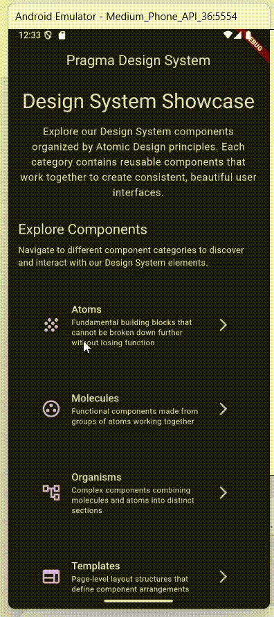

# Pragma Design System



Un Sistema de Diseño Flutter listo para producción construido sobre principios de **Atomic Design** que garantiza la separación de responsabilidades entre componentes UI, plantillas de layout y lógica de negocio mediante un patrón arquitectónico escalable.

## Instalación

Añade el sistema de diseño a tu proyecto Flutter:

```yaml
dependencies:
  pragma_design_system:
    path: ../pragma_design_system
```

## Uso Básico

**1. Comienza con el Sistema de Temas**
```dart
import 'package:pragma_design_system/pragma_design_system.dart';

class MyApp extends StatelessWidget {
  @override
  Widget build(BuildContext context) {
    return MaterialApp(
      theme: AppTheme.lightTheme,
      darkTheme: AppTheme.darkTheme,
      // tu app
    );
  }
}
```

**2. Usa Átomos para Elementos UI Consistentes**
```dart
// Reemplaza botones inconsistentes con átomos del sistema de diseño
AppButton(
  text: 'Enviar',
  onPressed: handleSubmit,
  variant: AppButtonVariant.primary,
)

// Tipografía consistente a través de funcionalidades
AppText('Perfil de Usuario', variant: AppTextVariant.titleLarge)
```

**3. Construye con Moléculas para Componentes Complejos**
```dart
// Campos de formulario con patrones de validación incorporados
AppFormField(
  label: 'Dirección de Email',
  validator: EmailValidator(),
  onChanged: updateEmail,
)

// Items de lista con patrones de interacción consistentes
AppListItem(
  title: 'Configuración de Cuenta',
  trailing: AppIcon(Icons.arrow_forward_ios),
  onTap: () => navigator.pushSettingsPage(),
)
```

**4. Usa Templates para Estructura de Página**
```dart
// Separa layout de lógica de negocio
class UserProfilePage extends StatelessWidget {
  @override
  Widget build(BuildContext context) {
    return FormPageTemplate(
      title: AppText('Editar Perfil'),
      sections: _buildProfileSections(),
      primaryAction: _buildSaveButton(),
    );
  }
  
  // La lógica de negocio permanece en la Page
  List<Widget> _buildProfileSections() { /* ... */ }
  Widget _buildSaveButton() { /* ... */ }
}
```

**5. Implementa Patrones de Feedback**
```dart
// Feedback consistente del usuario a través de la app
AppSnackbar.success(context, message: 'Perfil actualizado exitosamente');
AppSnackbar.error(context, message: 'Fallo en conexión de red');
AppSnackbar.info(context, message: 'Sincronización en progreso...');
```

## Documentación Completa

Para documentación detallada del sistema de diseño, arquitectura y componentes:

- **[Fundamentos](/documentation/foundations.md)** - Arquitectura, principios y filosofía del sistema
- **[Átomos](/documentation/atoms.md)** - Componentes fundacionales y tokens de diseño
- **[Moléculas](/documentation/molecules.md)** - Componentes funcionales compuestos
- **[Organismos](/documentation/organisms.md)** - Secciones complejas de interfaz
- **[Templates](/documentation/templates.md)** - Estructuras de layout sin estado
- **[Pages](/documentation/pages.md)** - Implementaciones completas con lógica de negocio

## Aplicación de Ejemplo

La aplicación example sirve como **documentación viva e interactiva** del sistema de diseño:

```bash
cd example
flutter pub get
flutter run
```

**Cada componente, desde átomos hasta páginas, cuenta con su propio showcase interactivo** que permite explorar:
- Demos en vivo de todos los componentes
- Ejemplos de uso y patrones de composición
- Estados de interacción y variantes visuales
- Implementaciones completas de páginas reales

## Desarrollo Local

### Prerrequisitos
- Flutter SDK (versión estable más reciente)
- Dart SDK
- IDE compatible (VS Code, Android Studio, IntelliJ)

### Configuración

1. **Clonar e instalar dependencias**:
   ```bash
   git clone [repository-url]
   cd pragma_design_system
   flutter pub get
   ```

2. **Ejecutar la documentación interactiva**:
   ```bash
   cd example
   flutter pub get
   flutter run
   ```

### Explorando el Sistema

1. **Comienza con HomePage**: Navega a través de categorías de componentes
2. **Revisa Átomos**: Entiende los bloques de construcción fundacionales
3. **Explora Moléculas**: Ve patrones de componentes funcionales
4. **Estudia Organismos**: Observa composición de componentes complejos
5. **Examina Templates**: Entiende arquitectura de layout
6. **Prueba Pages**: Experimenta implementaciones completas

La app example demuestra todo el sistema de diseño en acción y sirve como referencia primaria para patrones de implementación.

---

**Construido como demostración de arquitectura Flutter escalable y sistemas de diseño listos para producción.**
