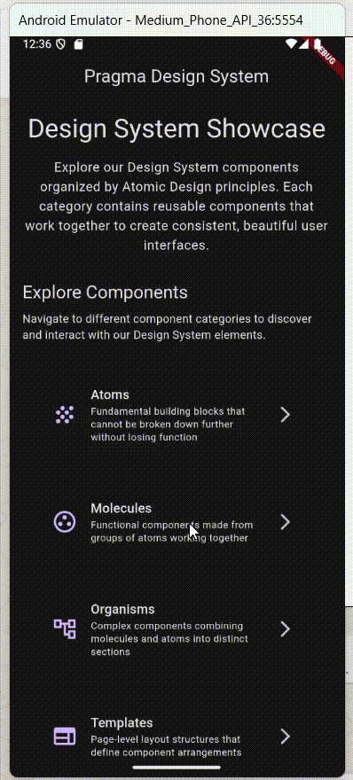

# Molecules: Componentes Funcionales

Componentes compuestos que combinan átomos en unidades funcionales cohesivas:

| Componente | Archivo | Propósito |
|------------|---------|-----------|
| **AppCard** | `app_card.dart` | Contenedor versátil con elevación, bordes redondeados e interactividad opcional |
| **AppFormField** | `app_form_field.dart` | Campo de formulario completo con label, validación y diferentes tipos de entrada |
| **AppListItem** | `app_list_item.dart` | Elemento de lista reutilizable con leading, trailing y contenido personalizable |
| **AppEmptyState** | `app_empty_state.dart` | Estado vacío motivacional con ilustración, mensaje y acción |
| **AppSection** | `app_section.dart` | Contenedor organizacional con título, descripción y contenido |
| **AppPrice** | `app_price.dart` | Componente especializado para mostrar precios con formato y moneda |