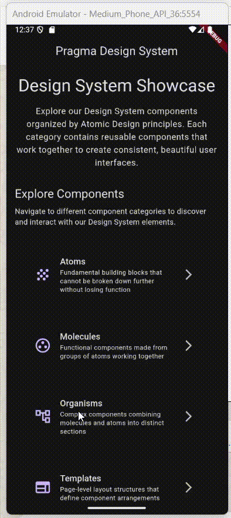

# Organisms: Secciones de Interfaz

Componentes complejos que crean secciones de interfaz autocontenidas:

| Componente | Archivo | Propósito |
|------------|---------|-----------|
| **AppFormSection** | `app_form_section.dart` | Agrupación lógica de campos de formulario con título y organización |
| **AppSettingsGroup** | `app_settings_group.dart` | Grupo organizado de elementos de configuración con separación visual |
| **AppEmptyStateSection** | `app_empty_state_section.dart` | Sección completa de estado vacío para páginas sin contenido |
| **AppProductListItem** | `app_product_list_item.dart` | Elemento especializado para mostrar productos con imagen, precio y acciones |
| **AppCardList** | `app_card_list.dart` | Lista organizada de tarjetas con spacing consistente y scroll |