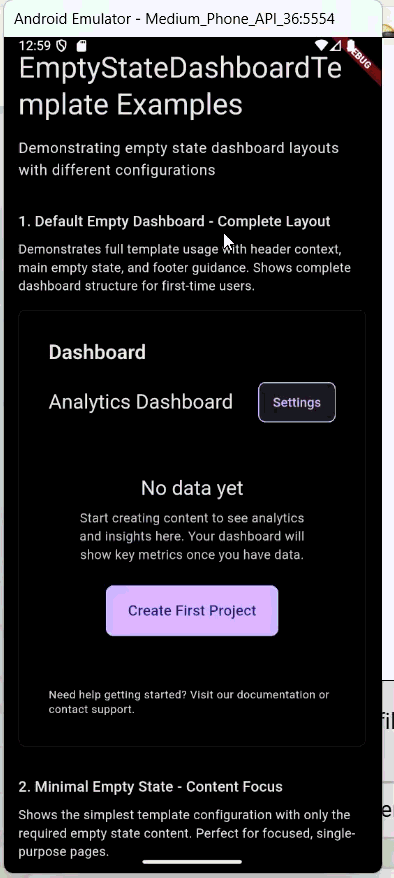

# Pages: Implementaciones Completas

Implementaciones completas de página que combinan templates con lógica de negocio y datos:

| Página | Archivo | Template Usado | Propósito |
|--------|---------|----------------|-----------|
| **HomePage** | `home_page.dart` | - | Navegación principal del sistema de diseño con catálogo de componentes |
| **FormPage** | `form_page.dart` | `FormPageTemplate` | Formulario completo de registro con validación y gestión de estado |
| **ProductListPage** | `product_list_page.dart` | `ProductListTemplate` | Listado de productos con toggle entre estado poblado y vacío |
| **SettingsPage** | `settings_page.dart` | `SettingsPageTemplate` | Página de configuraciones organizadas por grupos funcionales |
| **EmptyStateDashboardPage** | `empty_state_dashboard_page.dart` | `EmptyStateDashboardTemplate` | Dashboard vacío con onboarding y llamadas a acción |

## Navegación del Sistema
Estructura de catálogo interactivo y navegación:

| Página | Archivo | Propósito |
|--------|---------|-----------|
| **MoleculesListPage** | `molecules_list_page.dart` | Catálogo navegable de todas las moléculas con links a showcases |
| **OrganismsListPage** | `organisms_list_page.dart` | Galería de organismos complejos con ejemplos interactivos |
| **TemplatesListPage** | `templates_list_page.dart` | Showcase de plantillas disponibles con previews |
| **OtherPagesListPage** | `other_pages_list_pages.dart` | Índice de páginas de ejemplo que usan templates reales |

## Componentes Compartidos
Infraestructura reutilizable para navegación y demostración:

| Componente | Archivo | Propósito |
|------------|---------|-----------|
| **ShowcaseListItem** | `showcase_list_item.dart` | Elemento de lista reutilizable para navegación entre showcases |

## Documentación Interactiva
Páginas exhaustivas de showcase y navegación para exploración del sistema:

| Componente | Propósito |
|-----------|----------|
| **HomePage** | Hub de navegación del sistema de diseño y visión arquitectónica |
| **AtomsListPage** | Catálogo interactivo de componentes fundacionales |
| **MoleculesListPage** | Demostraciones de componentes funcionales con ejemplos en vivo |
| **OrganismsListPage** | Showcases de componentes complejos con patrones de interacción |
| **TemplatesListPage** | Galería de patrones de layout con ejemplos estructurales |
| **Individual Showcases** | Documentación detallada de componentes con ejemplos de uso |

## Ejemplos de Implementación de Referencia

El sistema de diseño incluye implementaciones completas de página que demuestran la separación adecuada Template/Page:

### ProductListPage
- **Template**: `ProductListTemplate` - Define estructura de layout de lista
- **Lógica de Page**: Gestión de datos de productos, funcionalidad de búsqueda, manejo de estado vacío
- **Demuestra**: Cómo las Pages proporcionan contexto de datos a Templates sin estado

### FormPage  
- **Template**: `FormPageTemplate` - Organiza secciones y acciones de formulario
- **Lógica de Page**: Validación de formulario, gestión de estado, manejo de envío
- **Demuestra**: Separación limpia entre estructura de layout y lógica de negocio de formulario

### SettingsPage
- **Template**: `SettingsPageTemplate` - Agrupa configuraciones en secciones lógicas
- **Lógica de Page**: Persistencia de configuraciones, enrutamiento de navegación, preferencias de usuario
- **Demuestra**: Cómo contenido complejo de página puede organizarse mediante composición de template

### EmptyStateDashboardPage
- **Template**: `EmptyStateDashboardTemplate` - Patrones de layout de onboarding
- **Lógica de Page**: Flujo de onboarding de usuario, seguimiento de engagement, enrutamiento de acciones
- **Demuestra**: Reutilización de template para diferentes contextos de estado vacío